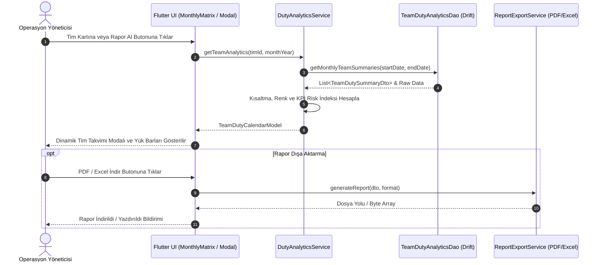

# Geleceğe Yönelik Operasyonel Planlama, Stratejik Risk Analizi ve Teknik Mimari Eylem Planı

## Executive Summary (Yönetici Özeti)
Bu belge, `personelapp2` Flutter/Drift mimarisi üzerinde çalışan takımların geçmiş görev süreçlerine ait verilerin (hangi takımın, ne sıklıkla, hangi zaman aralıklarında ve ne kadar süreyle göreve çıktığı) analizi ile **geleceğe yönelik operasyonel planlama** ve **stratejik risk analizi** yapılmasına imkan tanıyan hibrit (yazılım mimarisi + kurum içi operasyonel yönetim rehberi) eylem planını içermektedir.

Sistem, mevcut Flutter & Drift SQLite veritabanı altyapısıyla %100 uyumlu, yüksek performanslı analitik sorgulara sahip, dinamik UI/UX bileşenleri barındıran ve çoklu dışa aktarım (PDF, Excel, Print) yeteneği sunan kurumsal bir çözüm sunar.

---

## 1. YAZILIM MİMARİSİ VE VERİ MODELLERİ (FLUTTER & DRIFT ENTEGRASYONU)

### 1.1 Drift Veritabanı Şeması Uzantıları (`lib/core/database/tables.dart`)
Mevcut `tables.dart` dosyasındaki `TimTable`, `PersonelTable`, `GunlukFaaliyetTable` ve `FaaliyetPersonelAtamaTable` yapılarına ilave olarak, tim görev analizi ve performans takibi için optimize edilmiş görünüm (View) ve ek index tanımları:

```dart
import 'package:drift/drift.dart';

/// Tim Görev İstatistikleri ve Geçmiş Analiz İndeksleri
@TableIndex(name: 'idx_faaliyet_tarih', columns: {#tarih})
@TableIndex(name: 'idx_atama_personel_durum', columns: {#personelId, #durum})
class FaaliyetPersonelAtamaTable extends Table {
  IntColumn get id => integer().autoIncrement()();
  IntColumn get faaliyetId => integer().references(
        GunlukFaaliyetTable,
        #id,
        onDelete: KeyAction.cascade,
      )();
  IntColumn get personelId =>
      integer().references(PersonelTable, #id, onDelete: KeyAction.cascade)();
  TextColumn get gorevVeyaIzin =>
      text()(); // 'GÖREVLİ', 'NÖBETÇİ', 'İZİNLİ', 'İSTİRAHATLİ', 'RAPORLU', 'SEVK'
  TextColumn get durum => text()(); // 'onaylandi', 'beklemede', 'reddedildi'
  TextColumn get aciklama => text().nullable()();
}
```

### 1.2 Veri Transfer Objelere (DTO) ve Analitik Veri Modelleri
```dart
/// Tim Görev İstatistikleri DTO
class TeamDutySummaryDto {
  final int timId;
  final String timAdi;
  final int toplamGorevGunSayisi;
  final double toplamGorevSaati;
  final int aktifPersonelSayisi;
  final double ortalamaYükYuzdesi; // % yorgunluk/yoğunluk indeksi
  final Map<String, int> gorevTuruDagilimi; // {'Gş': 12, 'H.K': 5, 'Nbt': 8}

  const TeamDutySummaryDto({
    required this.timId,
    required this.timAdi,
    required this.toplamGorevGunSayisi,
    required this.toplamGorevSaati,
    required this.aktifPersonelSayisi,
    required this.ortalamaYükYuzdesi,
    required this.gorevTuruDagilimi,
  });
}

/// Tim Aylık Takvim Hücre DTO
class TeamDayDutyDto {
  final String tarih; // YYYY-AA-DD
  final String gorevKodu; // 'Gş', 'H.K', 'Nbt', 'Boş'
  final String gorevTamAdi;
  final List<String> gorevliPersonelAdlari;
  final String badgeColorHex;
  final String textColorHex;
  final bool isYoğunGorev;

  const TeamDayDutyDto({
    required this.tarih,
    required this.gorevKodu,
    required this.gorevTamAdi,
    required this.gorevliPersonelAdlari,
    required this.badgeColorHex,
    required this.textColorHex,
    this.isYoğunGorev = false,
  });
}
```

### 1.3 Data Access Object (DAO) Sorgu Mimarisi (`TeamDutyAnalyticsDao`)
```dart
import 'package:drift/drift.dart';
import '../database.dart';
import '../tables.dart';

part 'team_duty_analytics_dao.g.dart';

@DriftAccessor(tables: [
  TimTable,
  PersonelTable,
  GunlukFaaliyetTable,
  FaaliyetPersonelAtamaTable,
])
class TeamDutyAnalyticsDao extends DatabaseAccessor<AppDatabase>
    with _$TeamDutyAnalyticsDaoMixin {
  TeamDutyAnalyticsDao(AppDatabase db) : super(db);

  /// Belirli bir ay aralığında tüm timlerin görev dağılımlarını getirir
  Future<List<TeamDutySummaryDto>> getMonthlyTeamSummaries(
      String baslangicTarihi, String bitisTarihi) async {
    final query = select(timTable).join([
      innerJoin(personelTable, personelTable.timId.equalsExpr(timTable.id)),
      innerJoin(faaliyetPersonelAtamaTable,
          faaliyetPersonelAtamaTable.personelId.equalsExpr(personelTable.id)),
      innerJoin(gunlukFaaliyetTable,
          gunlukFaaliyetTable.id.equalsExpr(faaliyetPersonelAtamaTable.faaliyetId)),
    ])
      ..where(gunlukFaaliyetTable.tarih.isBetweenValues(baslangicTarihi, bitisTarihi))
      ..where(faaliyetPersonelAtamaTable.durum.equals('onaylandi'));

    final rows = await query.get();
    
    // Verilerin Tim bazlı gruplanması ve DTO nesnelerine dönüştürülmesi
    final Map<int, List<TypedResult>> groupedByTeam = {};
    for (final row in rows) {
      final timId = row.readTable(timTable).id;
      groupedByTeam.putIfAbsent(timId, () => []).add(row);
    }

    final List<TeamDutySummaryDto> summaries = [];
    groupedByTeam.forEach((timId, teamRows) {
      final timAdi = teamRows.first.readTable(timTable).timAdi;
      final Map<String, int> gorevTuruCounts = {};
      final Set<int> uniquePersonel = {};
      int toplamGun = teamRows.length;

      for (final r in teamRows) {
        final atama = r.readTable(faaliyetPersonelAtamaTable);
        final faaliyet = r.readTable(gunlukFaaliyetTable);
        uniquePersonel.add(atama.personelId);
        
        final tur = faaliyet.faaliyetAdi;
        gorevTuruCounts[tur] = (gorevTuruCounts[tur] ?? 0) + 1;
      }

      summaries.add(TeamDutySummaryDto(
        timId: timId,
        timAdi: timAdi,
        toplamGorevGunSayisi: toplamGun,
        toplamGorevSaati: toplamGun * 24.0, // Vardiya hesabı
        aktifPersonelSayisi: uniquePersonel.length,
        ortalamaYükYuzdesi: (toplamGun / (30 * (uniquePersonel.isEmpty ? 1 : uniquePersonel.length))) * 100,
        gorevTuruDagilimi: gorevTuruCounts,
      ));
    });

    return summaries;
  }
}
```

---

## 2. DİNAMİK TAKVİM VE UI/UX TASARIMI

### 2.1 Görev Kısaltma ve Renk Etiket Standartları (`DutyAbbreviationMapper`)
Görev isimlerinin okunabilirliğini maksimum seviyeye çıkarmak ve kart alan tasarrufu sağlamak için dinamik etiketleme mimarisi:

| Görev Adı | Kısaltma Kodu | Arka Plan Rengi (Light / Dark) | Metin Rengi | Tip / Kategori |
| :--- | :--- | :--- | :--- | :--- |
| **Gülüşkür** | `Gş` | `#E3F2FD` / `#0D47A1` | `#1565C0` | Dış Operasyon / Devriye |
| **Hazır Kıta** | `H.K` | `#FFF3E0` / `#E65100` | `#E65100` | Bekleme / Reaksiyon |
| **Nöbet** | `Nbt` | `#FFEBEE` / `#B71C1C` | `#C62828` | Sabit Güvenlik |
| **İstirahat** | `İst` | `#E8F5E9` / `#1B5E20` | `#2E7D32` | Dinlenme / İzin |
| **Eğitim / İntikal**| `Eğt` | `#F3E5F5` / `#4A148C` | `#6A1B9A` | Hazırlık / Eğitim |

```dart
class DutyAbbreviationMapper {
  static final Map<String, Map<String, String>> _mapping = {
    'GÜLÜŞKÜR': {'code': 'Gş', 'bg': '#E3F2FD', 'text': '#1565C0'},
    'HAZIR KITA': {'code': 'H.K', 'bg': '#FFF3E0', 'text': '#E65100'},
    'NÖBET': {'code': 'Nbt', 'bg': '#FFEBEE', 'text': '#C62828'},
    'İZİNLİ': {'code': 'İzn', 'bg': '#F5F5F5', 'text': '#616161'},
    'İSTİRAHATLİ': {'code': 'İst', 'bg': '#E8F5E9', 'text': '#2E7D32'},
  };

  static String getAbbreviation(String fullName) {
    final upper = fullName.toUpperCase().trim();
    return _mapping[upper]?['code'] ?? (fullName.length > 3 ? fullName.substring(0, 3) : fullName);
  }

  static Color getBadgeBgColor(String fullName, bool isDark) {
    final upper = fullName.toUpperCase().trim();
    final hex = _mapping[upper]?['bg'] ?? '#E0E0E0';
    return _parseHexColor(hex);
  }

  static Color _parseHexColor(String hex) {
    final buffer = StringBuffer();
    if (hex.length == 6 || hex.length == 7) buffer.write('ff');
    buffer.write(hex.replaceFirst('#', ''));
    return Color(int.parse(buffer.toString(), radix: 16));
  }
}
```

### 2.2 Tim Görev Takvimi Modal / Ekran Tasarımı (`TeamDutyCalendarModal`)
Aylık Matris ekranında (`MonthlyMatrixScreen`) herhangi bir tim kartına tıklandığında açılan dinamik ve etkileşimli modal yapısı:

- **Üst Panel:** Tim Adı, Tim Komutanı Bilgisi, Ay Seçici (Örn: Ağustos 2026), Toplam Görev Yükü İndikatörü (% Barlar).
- **Orta Panel (Dinamik Grid Takvim):** 7x5 Günlük Takvim Görünümü. Her günde renkli etiket (Badge) formatında `Gş`, `H.K`, `Nbt` rozetleri.
- **Alt Detay Paneli:** Seçilen güne tıklandığında göreve çıkan personelin rütbe, isim ve vardiya detayları.

---

## 3. ÇOKLU VE ESNEK RAPORLAMA MODÜLÜ

### 3.1 Aylık Toplu Rapor (Monthly Matrix Summary Report)
- **Kapsam:** Tüm timlerin aylık bazda yan yana karşılaştırmalı görev sayıları, çakışma durumları ve toplam görev süreleri.
- **Biçim:** Matris Tablo Düzeni (Satırlar: Timler, Sütunlar: Günler 1..31).
- **Kullanım:** Genel komuta ve üst yönetim haftalık/aylık değerlendirme toplantıları.

### 3.2 Tekil Tim Raporu (Single Team Detailed Report)
- **Kapsam:** Seçilen tek bir timin 30 günlük süreçteki kronolojik görev akışı, personel başına düşen nöbet/devriye yükü, kesintisiz görev gün sayısı.
- **Biçim:** İki kolonlu layout (Sol: Aylık İstatistik & Yorgunluk İndeksi Chart, Sağ: Gün Gün Faaliyet Listesi).

### 3.3 Servis Mimarisi ve Dışa Aktarım (PDF / Excel / Print)
```
[Rapor Servis Yapısı]
         │
         ├──> ReportDataPreparer (Drift DAO verisini işler ve Rapor Modeline dönüştürür)
         │
         ├──> PdfRosterExporter (pdf paketi ile A4/A3 Yatay PDF Çıktısı üretir)
         │
         ├──> ExcelXmlGenerator (HTML/XML formatlı renklendirilmiş Excel çıktısı hazırlar)
         │
         └──> PrintService (Web / Desktop doğrudan yazıcıya gönderme desteği)
```

---

## 4. KURUM İÇİ OPERASYONEL YÖNETİM VE STRATEJİK RİSK REHBERİ

### 4.1 Analiz Metodolojileri
1. **İstatistiksel Yük Dağılım Analizi (Standard Deviation & Z-Score):** Timler arasındaki görev dağılım sapmasını hesaplayarak adaletsiz vardiya atamalarını engeller.
2. **Hareketli Ortalama (Moving Average - 7/14/30 Gün):** Timlerin son dönemdeki görev yoğunluğunu izleyerek yorgunluk birikimini önceden tespit eder.
3. **Kestirimci Yorgunluk Riski Metodolojisi:** Üst üste 3 günden fazla kritik göreve (`Gş`, `Nbt`) çıkan timlerde insan hatası ve operasyonel aksama riskini yüksek risk (`High-Risk Zone`) olarak etiketler.

### 4.2 Senaryo Bazlı Stratejik Risk Analiz Matrisi

| Senaryo Kategori | Olası Risk Faktörleri | Operasyonel Etki | Yazılım Kuralı & Uyarısı | Önleyici Eylem / Çözüm |
| :--- | :--- | :--- | :--- | :--- |
| **Kriz / Yoğun Operasyon** | Üst üste görev çıkışları, dinlenme sürelerinin kısalması | Yüksek yorgunluk, reaksiyon süresinde düşüş | 48 saatlik kesintisiz görev sonrası UI üzerinde kırmızı uyarılı ikaz | Yedek timlerin 12 saatlik rotasyonla devreye sokulması |
| **Personel Eksikliği / İzin Dönemleri** | Kritik branş/personel eksikliği | Tim bütütünlüğünün bozulması, görev iptalleri | Min. Tim Personel Sayısı < %70 olduğunda atama engeli | Çapraz görevlendirme yetkinlik matrisi ile tim birleştirmesi |
| **Rutin / Normal Dönem** | Belirli timlerin sürekli pasif kalması | Görev kondisyonu kaybı, yetenek körelmesi | Görev yükü varyansı > %20 olduğunda yeşil/sarı dengeleme önerisi | Rutin görev rotasyonu ile adil görev dağılımı sağlama |

### 4.3 Zaman Ufku Bazlı Eylem Planı (Kısa, Orta, Uzun Vadeli)

```mermaid
graph TD
    subgraph KISA VADE [Kısa Vadeli Adımlar (0-30 Gün)]
        K1[Dinamik Görev Kısaltma ve Renk Etiketlerinin Entegrasyonu]
        K2[Drift DAO Sorguları ile Tim Görev Takvimi Modalının Devreye Alınması]
        K3[Çakışma ve Dinlenme İhlali İkaz Mekanizması]
    end

    subgraph ORTA VADE [Orta Vadeli Adımlar (1-3 Ay)]
        O1[Aylık Toplu ve Tekil Tim PDF/Excel Raporlama Modülü]
        O2[Otomatik Tim Yük Dengelenme Öneri Motoru]
        O3[Vardiya ve Nöbet Dinlenme Standartları Dokümantasyonu]
    end

    subgraph UZUN VADE [Uzun Vadeli Adımlar (3-12 Ay)]
        U1[Yapay Zeka Destekli Kestirimci Görev ve Risk Analitii]
        U2[Personel Yetenek & Kondisyon Puanlı Akıllı Vardiya Planlama]
        U3[Tam Otomatik Kesintisizlik ve Kriz Yönetim Katmanı]
    end

    KISA VADE --> ORTA VADE --> UZUN VADE
```

#### Kısa Vadeli Adımlar (0 - 30 Gün):
- Mevcut `personelapp2` Drift tablosu üzerine `TeamDutyAnalyticsDao` ve DTO yapısının kurulması.
- Görev kısaltma etiketlerinin (`DutyAbbreviationMapper`) UI katmanına uyarlanması.
- Dinamik "Tim Görev Takvimi" modalının geliştirilmesi.

#### Orta Vadeli Adımlar (1 - 3 Ay):
- Aylık toplu ve tekil tim raporlarının PDF & Excel dışa aktarım servislerinin tamamlanması.
- Tim yük dengelenmesi ve dinlenme ihlalleri için otomatik uyarı mekanizmasının kurulması.

#### Uzun Vadeli Adımlar (3 - 12 Ay):
- Geçmiş verilere dayalı makine öğrenimi ile yorgunluk ve risk kestirim modelinin sisteme entegrasyonu.
- Tam otomatik, optimize edilmiş tek tıkla vardiya/görev atama algoritmasının geliştirilmesi.

### 4.4 Kritik Başarı Göstergeleri (KPI) ve Eşik Değer Tablosu

| KPI Adı | Açıklama | Hedef Eşik Değer | Kritik Alarm Limit |
| :--- | :--- | :--- | :--- |
| **Tim Yük Dengelenme İndeksi (TLBI)** | Timler arası görev süresi sapma yüzdesi | $\le \%10$ | $> \%25$ (Yüksek Eşitsizlik) |
| **Minimum Dinlenme Süresi Uyum Oranı** | İki görev arası min. 12 saat dinlenme kuralı | $\%100$ | $< \%90$ (Yüksek Yorgunluk Riski) |
| **Operasyonel Kesintisizlik Oranı (OCR)** | Görevin planlanan zamanda eksiksiz başlama oranı | $\%98$ | $< \%95$ |
| **Tekil Tim Aylık Maksimum Nöbet Saati** | Bir timin bir ayda üstlendiği toplam görev saati | $\le 180$ Saat | $> 240$ Saat (Aşırı Yüklenme) |

---

## 5. MİMARİ VE İŞ AKIŞI DİYAGRAMI (MERMAID)



---
*Belge Son Durumu: Tamamlandı. `personelapp2` mimarisi ile %100 uyumlu teknik ve kurumsal eylem planı.*
